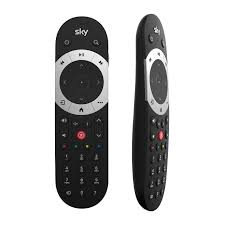

# ioBroker.sky-remote



[](https://www.npmjs.com/package/iobroker.sky-remote)
[](https://www.npmjs.com/package/iobroker.sky-remote)


**Tests:** 

## Sky Remote Adapter for ioBroker

Control Sky Q boxes via network commands

This adapter allows you to send remote control commands to Sky Q boxes over your network. It provides states for all remote buttons and allows you to send command sequences.

## Prerequisites

- ioBroker installation
- Sky Q box connected to your network
- IP address of your Sky Q box

## Installation

1. Install the adapter via ioBroker Admin
2. Configure the IP address of your Sky Q box in the adapter settings
3. Start the adapter

## Configuration

In the adapter settings, you need to configure:
- IP address or hostname of your Sky Q box
- Port (usually 49160 for Sky Q boxes)
- Connection check frequency (in milliseconds) - how often the adapter checks if the Sky box is online

### Connection Monitoring

The adapter periodically checks the connection to your Sky Q box and updates the `sky-remote.X.info.connection` state. This state shows whether the adapter can successfully connect to your Sky Q box:
- `true`: The Sky Q box is online and reachable
- `false`: The Sky Q box is offline or unreachable

You can use this state in your visualizations or scripts to monitor the status of your Sky Q box.

### Button Behavior

The adapter provides buttons that work as momentary push buttons. When you press a button:
1. The button state changes to `true`
2. The command is sent to the Sky Q box
3. The button state automatically resets to `false`

This allows you to press the same button multiple times in succession, which is essential for entering channel numbers (e.g., pressing 1, 0, 2 for channel 102).

## Usage

### States

The adapter creates the following states:

- `sky-remote.X.buttons.*` - States for each remote control button (e.g., `sky-remote.0.buttons.power`, `sky-remote.0.buttons.play`)
- `sky-remote.X.sendSequence` - Send a sequence of commands separated by commas

### Examples

- To press the power button: Set `sky-remote.0.buttons.power` to `true`
- To navigate to a channel: Set `sky-remote.0.sendSequence` to `"1,0,6"` (for channel 106)
- To open the TV guide and navigate: Set `sky-remote.0.sendSequence` to `"tvguide,right,right,select"`

### Available Commands

| Command | Description |
|---------|-------------|
| power | Power button |
| select | Select/OK button |
| backup | Back button |
| channelup | Channel up |
| channeldown | Channel down |
| interactive | Interactive button |
| help | Help button |
| services | Services button |
| tvguide / home | TV Guide/Home button |
| i | Information button |
| text | Text button |
| up | Up arrow |
| down | Down arrow |
| left | Left arrow |
| right | Right arrow |
| red | Red button |
| green | Green button |
| yellow | Yellow button |
| blue | Blue button |
| 0-9 | Number buttons |
| play | Play |
| pause | Pause |
| stop | Stop |
| record | Record |
| fastforward | Fast forward |
| rewind | Rewind |
| boxoffice | Box Office button |
| sky | Sky button |

## Integrating with Blockly

You can use the Blockly visual programming interface in ioBroker to create sequences of commands:

1. Create a new Blockly script
2. Use the "set state" block to set the `sendSequence` state
3. Add your comma-separated command sequence

## Integrating with JavaScript

Example to send a sequence of commands:

```javascript
// Press Guide, then right, then select
setState('sky-remote.0.sendSequence', 'tvguide,right,select');

// Turn on the TV and navigate to channel 101
setState('sky-remote.0.sendSequence', 'power,1,0,1');
```

## Troubleshooting

- Ensure your Sky Q box is powered on and connected to your network
- Verify the IP address of your Sky Q box is correct
- Check that port 49160 is open and accessible
- Check the adapter logs for any connection errors

## Changelog

<!--
	Placeholder for the next version (at the beginning of the line):
	### __WORK IN PROGRESS__
-->
### __WORK IN PROGRESS__
- (Alan Paris) Modernized adapter for community submission: jsonConfig admin UI, updated dependencies, CI/release tooling

### 1.0.0 (2025-05-05)
- (Alan Paris) Initial release

## License

MIT License

Copyright (c) 2026 Alan Paris <alan.paris@scottish.rugby>

Permission is hereby granted, free of charge, to any person obtaining a copy
of this software and associated documentation files (the "Software"), to deal
in the Software without restriction, including without limitation the rights
to use, copy, modify, merge, publish, distribute, sublicense, and/or sell
copies of the Software, and to permit persons to whom the Software is
furnished to do so, subject to the following conditions:

The above copyright notice and this permission notice shall be included in all
copies or substantial portions of the Software.

THE SOFTWARE IS PROVIDED "AS IS", WITHOUT WARRANTY OF ANY KIND, EXPRESS OR
IMPLIED, INCLUDING BUT NOT LIMITED TO THE WARRANTIES OF MERCHANTABILITY,
FITNESS FOR A PARTICULAR PURPOSE AND NONINFRINGEMENT. IN NO EVENT SHALL THE
AUTHORS OR COPYRIGHT HOLDERS BE LIABLE FOR ANY CLAIM, DAMAGES OR OTHER
LIABILITY, WHETHER IN AN ACTION OF CONTRACT, TORT OR OTHERWISE, ARISING FROM,
OUT OF OR IN CONNECTION WITH THE SOFTWARE OR THE USE OR OTHER DEALINGS IN THE
SOFTWARE.